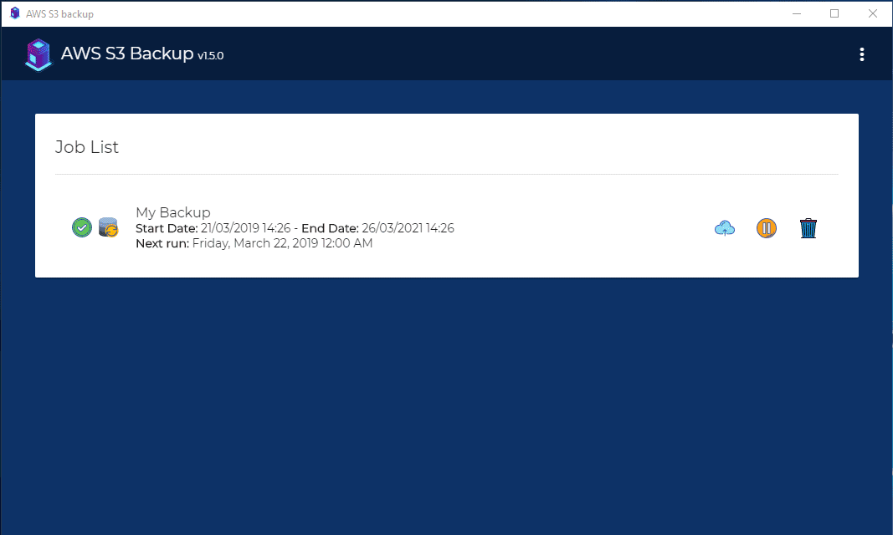

<p align="center">
  <br/>
  Backup on AWS S3 ? Never been so easy!
</p>

<p align="center">
    <a href="#"></a>
    <a href="#"></a>
    <a href="#"></a>   
</p>

# Introduction

This app allows you to use AWS (Amazon Web Services) S3 as backup system for desktop environments. 
Like Dropbox or Google Drive app you can backup your important data on AWS S3. 
This desktop app allows you to configure 3 different types of backup job (One time, recurring, live) to backup your data in an S3 bucket.

- **One time:** the backup job will be executed only one time as programmed.
- **Recurring:** the backup job will be executed periodically as programmed.
- **Live:** any time a file associated with the backup job changes it will be transferred to the S3 bucket.

This is a cross platform app, built with Electron, so you can use it on Windows, Mac and Linux.

## Requirement

This app use the AWS CLI "sync" command, this mean that **you must install the AWS CLI in order to use this app**. 

You can find the AWS CLI installer here: [Download AWS CLI](https://aws.amazon.com/cli/) 

## APP Settings

After installation go to settings page and configure the AWS credentials.

In order to use the app **you must set** an **"AWS access key ID"**, an **"AWS secret access key"** and an **"AWS Region"** that you can create through the [IAM service](https://docs.aws.amazon.com/en_us/IAM/latest/UserGuide/introduction.html) in the AWS console. 
The IAM user needs a programmatic access account with a correct read/write S3 policy attached (e.g AmazonS3FullAccess) and CloudWatch Metrics (e.g CloudWatchReadOnlyAccess). 
You can use any IAM S3 policy that grant access to the buckets that you want to use with the app.
Here an example policy: [IAM S3 example policy](https://docs.aws.amazon.com/en_us/IAM/latest/UserGuide/reference_policies_examples_s3_rw-bucket.html)

## Wiki

A complete and detailed documentation can be found here: [https://github.com/ulver2812/aws-s3-backup/wiki](https://github.com/ulver2812/aws-s3-backup/wiki)



## Windows executable (portable and installer)

[Download here](https://github.com/ulver2812/aws-s3-backup/releases) 

## Changelog

[Check changelog](https://github.com/ulver2812/aws-s3-backup/blob/master/CHANGELOG.md) 

## Getting Started

Clone this repository locally :

``` bash
git clone https://github.com/ulver2812/aws-s3-backup.git
```

Install dependencies with npm :

``` bash
npm install
```

## To build for development

- **in a terminal window** -> npm start
  
This start a local development environment with hot reload

You can activate/deactivate "Developer Tools" by commenting or not `win.webContents.openDevTools();` in `main.ts`.

## To build for production

- **in a windows terminal window** -> npm electron:windows   
- **in a mac terminal window** -> npm electron:mac   
- **in a linux terminal window** -> npm electron:linux

You will find the app build files in the "app-builds" directory.   

Don't forget to deactivate the "Developer Tools" by commenting `win.webContents.openDevTools();` in `main.ts`.

## Included Commands

|Command|Description|
|--|--|
|`npm run ng:serve:web`| Execute the app in the browser |
|`npm run build`| Build the app. Your built files are in the /dist folder. |
|`npm run build:prod`| Build the app with Angular aot. Your built files are in the /dist folder. |
|`npm run electron:local`| Builds your application and start electron
|`npm run electron:linux`| Builds your application and creates an app consumable on linux system |
|`npm run electron:windows`| On a Windows OS, builds your application and creates an app consumable in windows 32/64 bit systems |
|`npm run electron:mac`|  On a MAC OS, builds your application and generates a `.app` file of your application that can be run on Mac |
