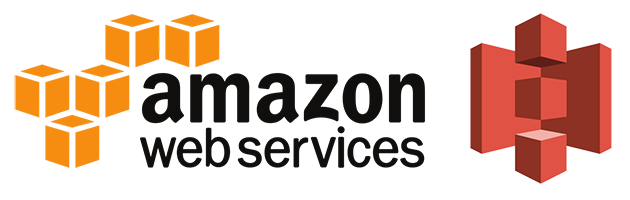

[](https://aws.amazon.com/s3/)

[![Make a pull request][prs-badge]][prs]
[](LICENSE)
[]()
[]()


# Introduction

This app allow you to use Amazon AWS Simple Storage Service (S3) as backup system for desktop environment. 
Like Dropbox or Google Drive app you can backup your important data on AWS S3. 
This desktop app allow you to configure 3 different types of backup job (One time, recurring, live) to backup your data in an S3 bucket.

- **One time:** the backup job will be executed only one time as programmed.
- **Recurring:** the backup job will be executed periodically as programmed.
- **Live:** any time a file associated with the backup job changes it will be transferred to the S3 bucket.

The app is designed with Electron and Angular so you can use it on Windows, Mac and Linux.

## Requirement:

This app rely on AWS CLI to use the efficient "sync" command, this mean that you need to install the AWS CLI on your own in order to use this app. 

You can find the AWS CLI installer here: [Download AWS CLI](https://aws.amazon.com/cli/) 


## Windows executable latest version

[Portable](https://github.com/ulver2812/aws-s3-backup/app-builds/AWS%20S3%20Backup%201.1.0.exe) 

[Setup](https://github.com/ulver2812/aws-s3-backup/app-builds/AWS%20S3%20Backup%20Setup%201.1.0.exe)

## Getting Started

Clone this repository locally :

``` bash
git clone https://github.com/ulver2812/aws-s3-backup.git
```

Install dependencies with npm :

``` bash
npm install
```

## To build for development

- **in a terminal window** -> npm start
  
This start a local development environment with hot reload

You can activate/deactivate "Developer Tools" by commenting or not `win.webContents.openDevTools();` in `main.ts`.

## To build for production

- **in a windows terminal window** -> npm electron:windows   
- **in a mac terminal window** -> npm electron:mac   
- **in a linux terminal window** -> npm electron:linux

You will find the app build files in the "app-builds" directory.   

Don't forget to deactivate the "Developer Tools" by commenting `win.webContents.openDevTools();` in `main.ts`.

## Included Commands

|Command|Description|
|--|--|
|`npm run ng:serve:web`| Execute the app in the browser |
|`npm run build`| Build the app. Your built files are in the /dist folder. |
|`npm run build:prod`| Build the app with Angular aot. Your built files are in the /dist folder. |
|`npm run electron:local`| Builds your application and start electron
|`npm run electron:linux`| Builds your application and creates an app consumable on linux system |
|`npm run electron:windows`| On a Windows OS, builds your application and creates an app consumable in windows 32/64 bit systems |
|`npm run electron:mac`|  On a MAC OS, builds your application and generates a `.app` file of your application that can be run on Mac |

## AWS app settings

In order to use the app you need to set in the settings page an "AWS access key ID" and an "AWS secret access key" that you can create through the IAM service in the AWS console. 
The IAM user needs a programmatic access account with a correct read/write S3 policy attached. You can use any IAM S3 policy that grant access to the buckets that you want to use with the app.
Here an example policy: [IAM S3 example policy](https://docs.aws.amazon.com/en_us/IAM/latest/UserGuide/reference_policies_examples_s3_rw-bucket.html)

## To correctly quit the app

When you try to quit the app the normal behaviour is that the app minimize herself in the tray icon and still run.
To correctly quit the app right click on the tray icon and click "quit".

## More information

This app is built with the [maximegris/angular-electron](https://github.com/maximegris/angular-electron) 
project, for more information visit the repo.

[license-badge]: https://img.shields.io/badge/license-Apache2-blue.svg?style=flat
[license]: https://github.com/ulver2812/aws-s3-backup/LICENSE
[prs-badge]: https://img.shields.io/badge/PRs-welcome-brightgreen.svg?style=flat-square
[prs]: http://makeapullrequest.com
